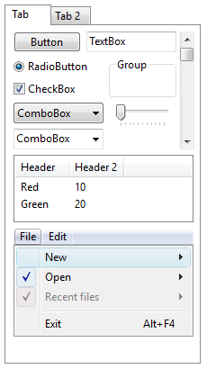
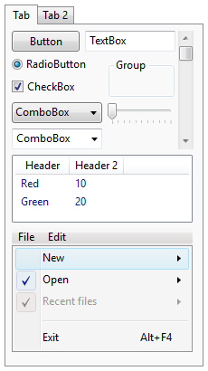
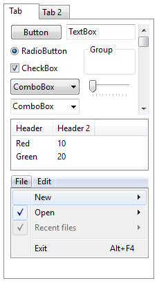
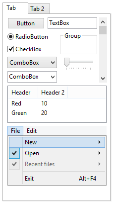
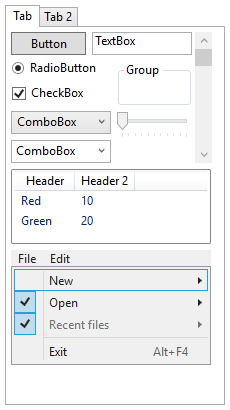
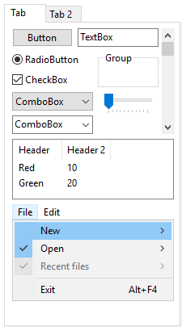
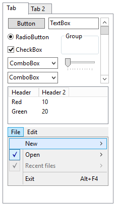
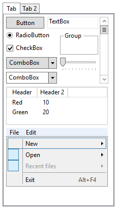

Motivation
==========


WPF Has No Proper System Theme
------------------------------

Ever since the inception of WPF the provided system theme for Aero was lacking
in polish and features, and Microsoft does not seem to care. Over the years this
only has gotten worse.

When WPF was released with Windows Vista the provided Aero theme looked most
closely like the native theme. This had to the case because being praised as the
successor to Windows Forms and good support for interop with native (and WinForms)
controls.

Native Windows Vista | WPF Aero
---------------------|-----------------------
 | 

Some elements are a bit off, with the menu bar diverging the most and looking
quite cheap. It supports Aero's subtle animations for elements like buttons or
scrollbars but does not respect the system-wide animation flag.

Windows 7 had mostly the same Aero theme. Menus received a more blueish tint.
But the WPF theme was not updated.

Native Windows 7 | WPF Aero
-----------------|-----------------------
 | 

The first major change for Aero came with Windows 8. More blue, rounded corners
vanished, elements became flatter. And WPF received an updated theme which looks
nothing like the native theme. It uses wrong blue tones all over the place,
lacks subtle gradients and animations, and popups have no drop shadow.

Native Windows 8 | WPF Aero2
-----------------|-----------------------
 | 

Microsoft noticed that their scheme of choosing a theme resource assembly based
on the name of the native theme did not work anymore (because it is still called
Aero!). But instead of properly solving this problem they chose a bandaid which
replaces `Aero` with `Aero2` if the Windows version is 8 or later.

Windows 8 also replaced the basic theme with AeroLite. While a lot simpler,
the WPF AeroLite still looks cheap in comparison.

Native Windows 8 AeroLite | WPF AeroLite
-----------------|-----------------------
 | 


With Windows 10 Aero received its next overhaul and with WPF apparently on
life support there were no changes for WPF.

Native Windows 10 Aero | WPF Aero2
------------------|-----------------------
 | 

Native Windows 10 AeroLite | WPF AeroLite
------------------|-----------------------
 | 


Inability to Override the System Theme
--------------------------------------

The lack of a proper system theme would not be that bad if it were possible to
provide your own. One would think that with such a powerful themeable framework
giving the users the possibility of choosing/overriding the system theme would
be a given. While it is indeed possible to provide custom styles for controls,
these are not treated as system styles which has subtle but annoying consequences.

When WPF applies a style, it first sets all properties defined in the style
(including those defined in BasedOn styles). Next, all properties of a matching
system style (if found) that have not been set already are applied. So in effect
each custom style has an implicit base style.

As a consequence:

- Whenever you define custom styles for standard controls you have to explicitly
  add a `BasedOn` attribute and reference the previous style:

  ```xaml
  <Style TargetType="{x:Type Button}" BasedOn="{StaticResource {x:Type Button}}">
  </Style>
  ```

- Even without a custom style, certain controls require an explicit style attribute.
  For example, a [ListView](xref:System.Windows.Controls.ListView) without
  [GridView](xref:System.Windows.Controls.GridView) normally inherits the
  [ListBox](xref:System.Windows.Controls.ListBox) style automatically but now
  requires an explicit style attribute.

  ```xaml
  <ListView Style="{StaticResource {x:Type ListBox}}"/>
  ```

- Some elements like the context menu of a [TextBox](xref:System.Windows.Controls.TextBox)
  cannot be overridden that way.


The limited way WPF chooses theme resources (using just Aero or Aero2 for
four different Aero versions) also precludes any easy and faithful reproduction.
